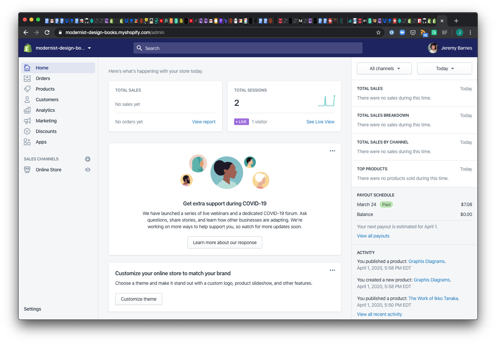
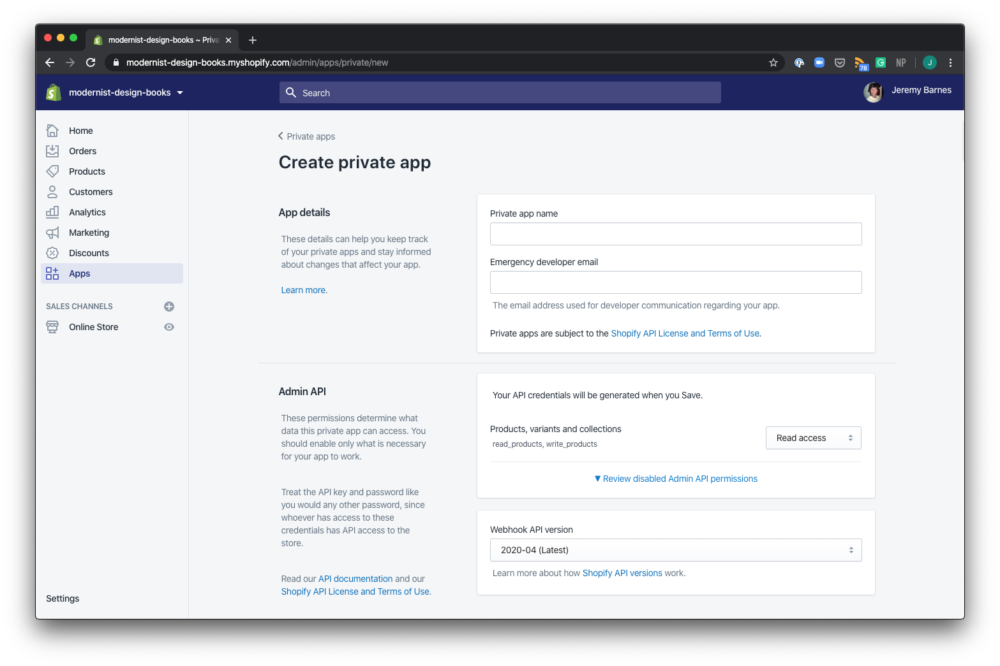
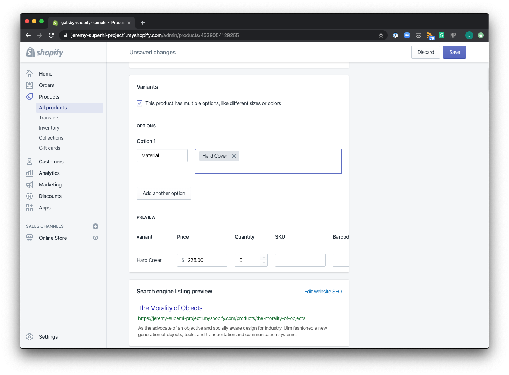
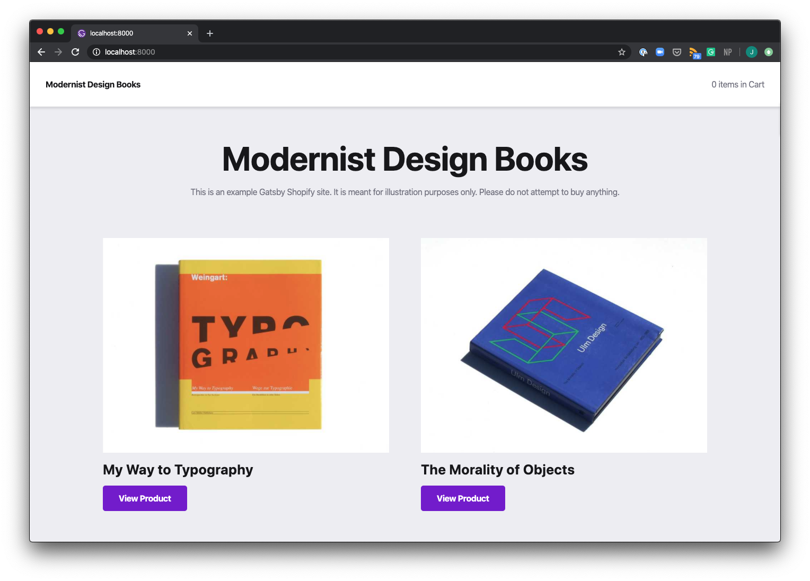
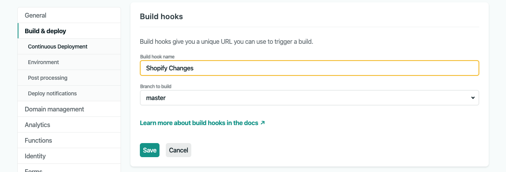
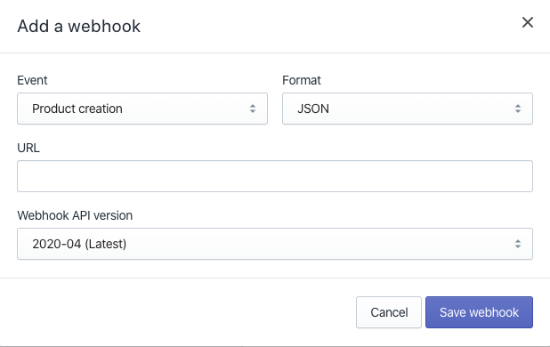
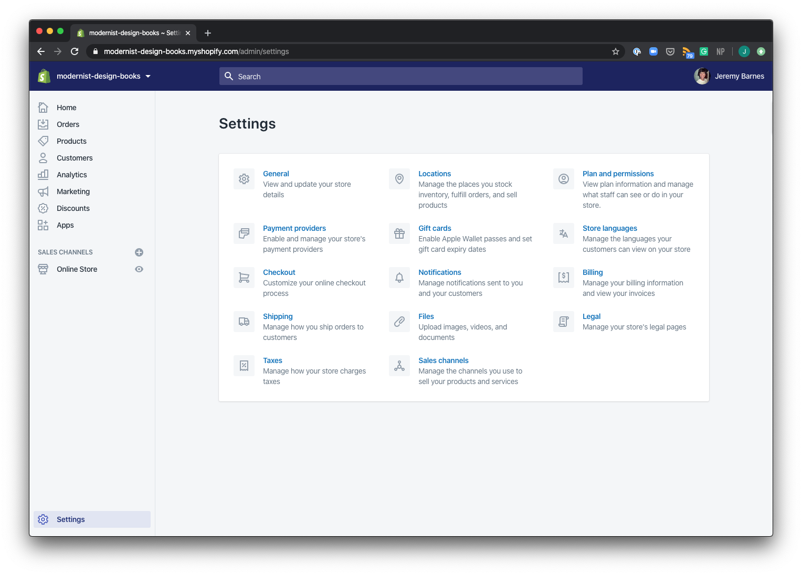
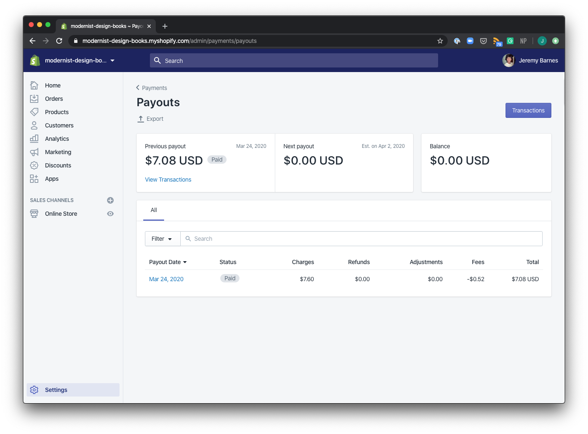

# Gatsby Shopify Starter

This is a Gatsby Shopify Store starter, complete with cart and checkout functionality, and styled with [Theme-UI](https://theme-ui.com/). It is available for configuration and use with any Shopify store.

[View the Live Site Here](https://modernist-design-books.netlify.com/)

## Intended Use

I built this starter as an opportunity for others to learn and see how a Gatsby Shopify site can be created. I have supplied several comments throughout the code to help explain what the different parts are doing and how to use them.

## Readme Contents:

-   [Helpful Resources](#helpful-resources)
-   [Getting Started](#getting-started)
-   [Create a new Shopify store](#create-a-new-shopify-store)
-   [Create a private app](#create-a-private-app)
-   [Populate your app with products](#populate-your-app-with-products)
-   [Connect your Gatsby site to Shopify](#connect-your-gatsby-site-to-shopify)
-   [Use Shopify to trigger builds in Netlify](#use-shopify-to-trigger-builds-in-netlify)
-   [Connect your bank account for transactions](#connect-your-bank-account-for-transactions)

## Helpful Resources:

-   [View the Live Site Here](https://modernist-design-books.netlify.com/)
-   [Build a Gatsby ecommerce site with Shopify](https://www.gatsbyjs.org/docs/building-an-ecommerce-site-with-shopify/)
-   [Shopify Buy API](https://www.npmjs.com/package/shopify-buy#completing-a-checkout)
-   [Authenticate a private app with Shopify](https://shopify.dev/tutorials/create-a-checkout-with-storefront-api#completing-the-checkout)
-   [Set up Shopify Payments](https://help.shopify.com/en/manual/payments/shopify-payments)
-   [Set up Shopify Webhooks to trigger Netlify Builds](https://github.com/gatsbyjs/store.gatsbyjs.org/issues/4)

## Getting Started

#### Create a new Shopify store

-   If you haven't already, [create a new Shopify Account](https://www.shopify.com/) and store.
-   Personally, I recommend signing up for their [partner program](https://www.shopify.com/partners) where you can experiment with multiple different `Development Stores` for experimentation and transfer ownership to store owners when you are ready.
-   Login to your account and create a new store
-   Your URL should read `yourStoreName.myshopify.com/admin`, and you should see something akin to the following:
    

#### Create a Private App

-   In your Admin view, create a `private app`:
    -   navigate to your `Apps`
    -   click the ( undiscoverable ) `Manage private apps` link at the bottom of your `Apps` page.
    -   select `create a new private app`, and you should see the following:
        
    -   Provide a `private app name`, leave your `Admin API` credentials as `Read Access`
    -   Towards the bottom check "Allow this app to access your storefront data using the Storefront API."
    -   Check `Read product tags` and `Read customer tags` in addition to the default permissions.
    -   Click Save.

#### Populate your app with products:

-   In your Products view, click add product. For the best experience, I recommend filling in data for the following:
    -   Title
    -   Description
    -   Media
    -   Pricing ( Price )
    -   Inventory (Quantity, Track Quantity)
    -   Shipping (Weight, Country of origin)
    -   Variants (Optional, as this starter supports variants)
-   I would recommend adding at least 2 products, with perhaps some variants ( i.e. in mine, I added a soft cover and a hard cover, for "materials"), see image below:
    

#### Connect your Gatsby site to Shopify:

-   Let's connect your Shopify store to your Gatsby App now.

    -   First clone this repo to your computer.
    -   Open this repo in your code editor
    -   Run `yarn install` to install all dependencies
    -   Run `yarn develop`, and you should now see the following:

        

    -   Now, to pull in your own products from Shopify, all you need to do is update the `.env.development` variables in this project.
    -   The `.env` file will look as follows:

    ```
    GATSBY_SHOP_NAME = jeremy-superhi-project1
    GATSBY_SHOPIFY_ACCESS_TOKEN = a3155a160132b0ae0bf6bc40fa1c0dc0
    ```

    -   Your `GATSBY_SHOPIFY_ACCESS_TOKEN` will be your `Storefront access token` from your Shopify App.
    -   To access this, in your Shopify Store, navigate to Apps > Private Apps > `<YourPrivateApp>` page. Scroll to the bottom and you'll see your `Storefront access token`.
    -   Copy this token, and set`GATSBY_SHOPIFY_ACCESS_TOKEN` equal to your `Storefront access token`.
    -   Now, let's update the `GATSBY_SHOPIFY_ACCESS_TOKEN`. You can find this by looking at your Shopify Shop URL:
        -   `https://<yourShopName>.myshopify.com/admin`
        -   copy the `<yourShopName>` portion from the URL, and set `GATSBY_SHOP_NAME` equal to it.
    -   Now, stop your server and run `gatsby clean`. This clears your cache so you don't run into any problems.
    -   Next, run `yarn develop` and you should see the store populated with your shop items.

## Use Shopify to trigger builds in Netlify

If you have deployed your site to Netlify using Continuous Integration with Github, then you can also trigger new builds of your site when you make content updates in Shopify. You can accomplish this through Webhooks:

-   In Netlify, navigate to your "Settings" page.
-   Next click on "Build & deploy" and scroll to the "Build Hooks" section
-   Create a new build hook and call it `Shopify Changes`

    

-   Now copy the Build Hook URL to your clipboard.
-   Navigate over to your Shopify Store.
-   In your store, navigate to Settings > Notifications > and Scroll to the bottom.
-   You will see a "Create webhook" button. Click this and select `Product creation` for event type. Paste your Netlify Build Hook URL in the `URL` field. Click "Save webhook."

    

-   Your site will now rebuild every time you publish a new product.
-   I also chose to set up an event for `Product update` and `Product delete` using the same Netlify Build Hook, so my store updates whenever any of these events are triggered in Shopify.

## Connect your bank account for transactions:

-   If you're satisfied with your setup, you can connect your bank account for transactions:

    -   In your Shopify store, click "Settings." You should see the following:
        
    -   Follow these [Shopify instructions to set up Payment Providers](https://help.shopify.com/en/manual/payments/shopify-payments/setting-up-shopify-payments#set-up-shopify-payments).
    -   For more details around Payment Providers, you can visit [Shopify's documentation](https://help.shopify.com/en/manual/payments).
    -   Once you have set up Payment Providers, you can click "View Payouts" to see your transactions and their status.

        

    -   You can also view incoming orders through your "Orders" tab in the left nav.
